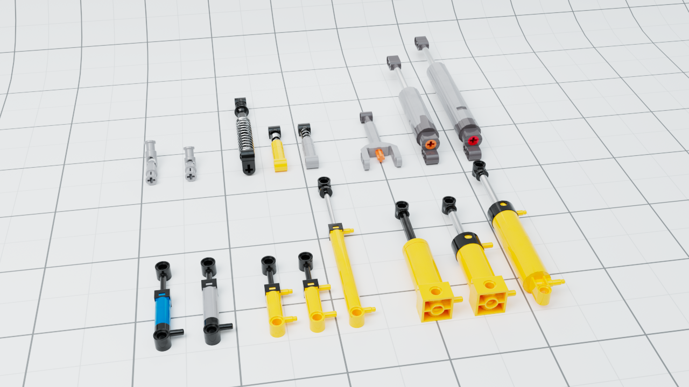

# Studio hack to turn more parts into sub assemblies
### I found a small hack to turn more parts into sub assemblies in Studio. In this repository I will share all parts that I configure to be sub assemblies.
 
 

## Update - Added "CustomParts" folder and fixed connectivity
I realized that a lot of the parts lost connectivity when turned into submodels. To fix this I made custom connectivity for the subparts. These can be located in the CustomParts folder and will not be replaced when updating Studio.

I also found a way to make this work for Custom Parts. I have added the XL Actuator (from Philo's parts pack) to the CustomParts folder and to the "StudioPartDefinition"-file. This makes the part behave like a sub assembly and as a bonus it shows up in the Master palette. So no need to go to the Custom Palette to find it.
 
 

## Installation Windows:
This hack will only work for Studio 2.0 - Version 2.2.8_1
1. Download "StudioPartDefinition2.txt" from this repository
2. Make a copy of "StudioPartDefinition2.txt" in "C:\Program Files\Studio 2.0\data" and call it "StudioPartDefinition2.txt.bk" or something
3. Replace the original file in "C:\Program Files\Studio 2.0\data" with the downloaded one
4. Download "CustomParts" folder and put it in "C:\Users\\<usename>\AppData\Local\Stud.io" (If it doesn't exist just create it)
5. Restart Studio
 
 

## Installation Mac:
1. Download "StudioPartDefinition2.txt" from this repository
2. Make a copy of "StudioPartDefinition2.txt" in "[drive name]/Users/[account name]/Applications/Studio 2.0/data" and call it "StudioPartDefinition2.txt.bk" or something
3. Replace the original file in "[drive name]/Users/[account name]/Applications/Studio 2.0/data" with the downloaded one
4. Download "CustomParts" folder and put it in "[drive name]/Users/[account name]/Applications/Studio 2.0/ldraw/"  (If it doesn't exist just create it)
5. Restart Studio
 
 

## Current parts:

## Known issues:
Some of the parts will have to be replaced in existing builds for it to work. These are the affected parts:
- 9244c01 - Technic, Universal Joint 4L
- 61927c01 - Technic Linear Actuator with Dark Bluish Gray Ends
- 92693c01 - Technic Linear Actuator Mini with Dark Bluish Gray Head and Orange Axle
- 2909c03 - Technic, Shock Absorber 9.5L (Soft Spring)
- And some of the pneumatic parts

## Feedback:
Please let me know if there are more parts I should add

 
 

## Thanks to Philo Hurbain for invaluable Ldraw help
### For more parts packs visit: https://philohome.com/studio/packs.htm
